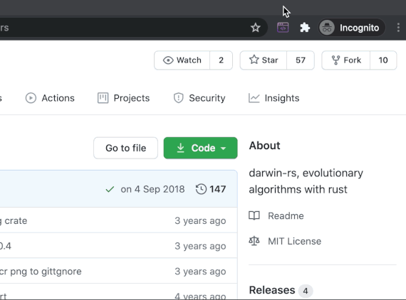

# Programmable Clipboard
Chrome extension which allows transforming the text you copy in a browser with your javascript code.

## Installation
1. [Download](https://github.com/tuqqu/programmable-clipboard/archive/master.zip) and unpack the zip or `git clone https://github.com/tuqqu/programmable-clipboard.git`
2. Go to `chrome://extensions` in Google Chrome
3. Enable **Developer mode** in the top right corner
4. Click **Load unpacked** in the top left corner
5. Select the unpacked directory
6. Pin the extension on the bar

## Usage
1. Click on the icon
2. The argument `data` is your clipboard data (when you copy something in chrome)
2. Write javascript code to transform `data`
3. The value of `data` on the last line will be written to your clipboard
